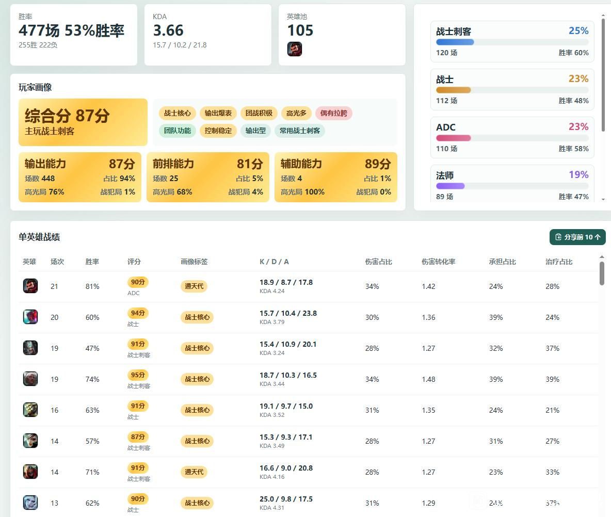

<p align="center">
  
</p>

<h1 align="center">LOL Stats</h1>

<p align="center">
  专注于国服英雄联盟客户端的战绩查询、玩家画像与实时对局分析工具
</p>

<p align="center">
  当前版本：<strong>v0.7.0</strong> ·
  <a href="https://github.com/cridyy/lol-stats/releases">GitHub Releases</a> ·
  <a href="https://gitee.com/Crescenre/lol-stats/releases">Gitee Releases</a> ·
  <a href="https://crescendum.lanzout.com/b00rp145sh">蓝奏云下载</a>（密码：<code>djvm</code>）
</p>

LOL Stats 使用 Tauri 2、Rust 和 Vue 3 开发，主要解决两件事：

- 查询当前账号或其他国服玩家的历史战绩、英雄统计、评分和玩家画像。
- 在选人或游戏阶段读取双方玩家近期表现，快速判断玩家风格、能力和组排关系。

> 当前版本只面向 Windows 国服客户端开发和测试，不支持 Riot 直营服。

## 界面预览

<p align="center">
  
</p>

<p align="center">
  <sub>数据统计、玩家画像与单英雄战绩</sub>
</p>

## 功能概览

### 当前角色与查战绩

- 自动发现本机正在运行的 `LeagueClientUx.exe`，无需管理员权限。
- 当前战绩默认读取最近 20 局，滚动到底部后按 20 局继续增量加载，最多 1000 局。
- 显示单双排、灵活组排当前段位与历史最高段位，并使用对应段位图标。
- 支持手动刷新当前战绩和数据统计。
- 查战绩支持 Riot ID、PUUID、指定区服和不限区服候选搜索。
- 输入完整的 `GameName#Tag` 并指定区服时，可直接打开玩家总览。
- 只输入名称或选择不限区服时，点击搜索后展示候选玩家，不在输入过程中打扰操作。
- 查询历史保存在本地，支持悬停删除与确认提示。

### 数据统计与玩家画像

- 统计场次支持 `50 / 100 / 200 / ... / 1000`，默认 500 场，也可手动输入。
- 支持起始日期和结束日期筛选。
- 英雄搜索同时支持英雄名称与称号，例如“薇恩”和“暗夜猎手”。
- 展示胜率、K/D/A、伤害占比、伤害转化率、承伤占比、治疗占比等指标。
- 英雄池展示使用次数排名前五的英雄头像。
- 展示位置使用分布与胜率，并将战士、刺客及混合战刺定位归入“战刺”统计大类。
- 单英雄统计包含场次、胜率、评分、评价、定位和代表标签。
- 点击英雄横条可进入该英雄对应模式的全部具体战绩，并保持返回前的滚动位置。
- 玩家画像分别统计综合能力、输出能力、前排能力和辅助能力。
- 评分系统会结合英雄标签、结算装备、伤害、伤转、参团、生存、承伤、治疗和控制等数据。
- 短时碾压局会使用全场数据、K/D 差、伤害差、阵容和推塔情况进行受控校准。

评分公式、定位判断、分数构成和标签条件见 [评分系统说明](docs/scoring-system.md)。

### 数据筛选

数据统计页中的“数据筛选”按需计算，计算结果会在本地持久化：

- 红蓝方场次与胜率。
- 自定义装备、英雄、位置和经济区间，比较出装与未出装的概率、胜率和经济表现。
- 百分比穿透装备在指定经济区间下的覆盖率与胜率。
- 队伍经济最高、伤害最高时的胜率表现。
- 海克斯强化登场率与胜率，并按同色有效选择机会计算概率。
- 装备和海克斯选择器只展示当前样本中真实出现过的内容，避免混入其他地图或测试资源。

### 实时战绩

- 每秒检测游戏流程，进入游戏加载或游戏阶段时自动切换到实时战绩页。
- 每 15 秒自动刷新；数据未变化时不会重复计算或整页重绘。
- 对局结束后保留上一局实时战绩，直到下一局开始。
- 我方固定显示在上方，敌方显示在下方，不再依赖蓝红方排序。
- 根据当前对局模式筛选历史样本：
  - 海克斯大乱斗只使用海克斯大乱斗战绩。
  - 极地大乱斗只使用大乱斗战绩。
  - 排位只使用单双排与灵活组排战绩。
  - 匹配使用匹配与排位战绩。
- 每名玩家按 20 局分批扫描，最多扫描 150 局，凑取 50 局时长不少于 8 分钟的有效样本。
- 展示双方平均胜率、平均伤害、平均 KDA、平均伤转、平均承伤和平均评分。
- 玩家卡片展示近期胜率、KDA、伤转、承伤、综合画像、输出能力、carry 率和战犯率。
- 游戏阶段展示所选英雄的历史评分与标签。
- 支持识别客户端分组，并结合历史同队记录推断组排关系。
- 点击玩家 Riot ID 可直接打开该玩家总览。
- 评分结果与玩家画像采用单次计算和弱引用缓存，避免实时页重复评分导致卡顿。

### 详细战绩

- 点击任意具体对局后，在“详细战绩”导航页创建总览标签。
- 总览展示双方玩家的英雄、技能、装备、符文或强化、K/D/A、伤害、经济、承伤、治疗、伤转、评分和标签。
- 可在总览中点击玩家，继续打开该玩家主页；再点击具体对局后打开对应英雄标签。
- 详细战绩支持多标签循环钻取。
- 左侧前进、后退会同步恢复页面和标签状态。
- 隐藏页面保留 10 分钟，最多缓存 20 个页面，减少反复请求。
- 页面切换、标签切换和返回操作会尽量保持各自滚动位置。
- 支持查看对局内玩家的历史能力画像。

### 分享截图

- 对局总览、单英雄排行和单英雄具体战绩支持生成 PNG 并复制到剪贴板。
- 支持电脑版和手机版两套截图排版，手机版布局默认开启。
- 可在设置中调整单英雄排行截图数量和单英雄具体战绩截图数量。
- 分享截图会保留评分、评价、标签、时间、对局时长和关键数据高亮。

### 工具页

- **AramKit**：内嵌第三方数据页面，保留原始来源和外部浏览器打开入口。
- **实时英雄**：实时战绩出现所选英雄时，自动生成对应英雄的动态 AramKit 标签。
- **海克斯设计**：使用本地海克斯素材设计自定义强化，支持保存和分享图片。
- **由夯到拉**：将英雄拖入“夯、顶级、人上人、NPC、拉完了”五档排行，支持多方案保存、清空和导出图片。
- **好友**：读取好友列表、在线状态、成为好友时间、近 20 局胜率和上次游戏时间。
- **好友管理**：支持搜索、收藏、拖动排序、指标排序、状态轮询和战绩本地缓存。
- **快捷工具**：自动接受对局、锁定游戏内设置、退出结算页面、设置聊天状态和聊天签名。

### 设置与更新

- 保存当前窗口大小，下次启动自动恢复；支持一键重置默认尺寸。
- 可增加实时战绩玩家卡片高度，显示更多小战绩。
- 可设置分享截图数量和手机版布局。
- 左下角显示当前版本号。
- 首次启动新版本时显示更新日志。
- 通过 Gitee 的 `update.json` 检查新版本，只提示更新，不执行静默自动更新。
- 更新弹窗展示本次更新内容，可复制下载密码；打开下载页时也会自动复制密码。

## 技术栈

- Tauri 2
- Rust
- Vue 3
- TypeScript
- Vite
- SQLite / rusqlite
- lucide-vue-next
- html-to-image

## 目录结构

```text
lol-stats
├─ docs
│  └─ scoring-system.md          # 当前评分系统完整说明
├─ scripts
│  └─ publish-release.ps1        # GitHub / Gitee Release 自动发布
├─ src
│  ├─ api.ts                     # Tauri 命令调用封装
│  ├─ assetLoader.ts             # LCU 图片资源批量加载与内存缓存
│  ├─ funStats.ts                # 数据筛选计算与持久化
│  ├─ imageShare.ts              # 截图生成与剪贴板复制
│  ├─ matchTeamSummary.ts        # 对局团队汇总
│  ├─ notifications.ts           # 全局顶部通知
│  ├─ playerProfile.ts           # 玩家画像与单英雄画像
│  ├─ rankIcons.ts               # 段位图标映射
│  ├─ roleClassifier.ts          # 英雄与装备定位判断
│  ├─ scoring.ts                 # 单局百分制评分与标签
│  ├─ toolSettings.ts            # 快捷工具本地设置
│  ├─ types.ts                   # 前端数据类型
│  ├─ utils.ts                   # 公共格式化与统计函数
│  ├─ App.vue                    # 主界面、导航、更新与页面状态
│  └─ components
│     ├─ FriendsTool.vue         # 好友管理
│     ├─ FunStatsPanel.vue       # 数据筛选
│     ├─ GameRecordList.vue      # 通用战绩横条
│     ├─ HextechAugmentDesigner.vue # 海克斯设计
│     ├─ LiveGamePanel.vue       # 实时战绩面板
│     ├─ MatchOverviewPanel.vue  # 单局十人总览
│     ├─ PlayerRecordTab.vue     # 详细战绩玩家页
│     ├─ RecordView.vue          # 当前角色 / 查询结果通用视图
│     ├─ ReservedTools.vue       # 快捷工具
│     ├─ StatsPanel.vue          # 数据统计与玩家画像
│     ├─ ToastStack.vue          # 顶部通知
│     └─ ToolsPanel.vue          # 工具页编排
├─ src-tauri
│  ├─ nsis                      # 中文 NSIS 安装配置
│  └─ src
│     ├─ commands.rs             # 暴露给前端的 Tauri 命令
│     ├─ lib.rs                  # Tauri 入口与命令注册
│     └─ services
│        ├─ client_discovery.rs  # LeagueClientUx 发现与参数解析
│        ├─ error.rs             # 后端统一错误
│        ├─ lcu.rs               # LCU / Riot Client 请求封装
│        ├─ models.rs            # 客户端响应与输出模型
│        ├─ sgp.rs               # 国服 SGP 深战绩请求
│        ├─ stats.rs             # 增量战绩、SQLite 缓存与聚合
│        └─ tools.rs             # 游戏设置锁定等快捷工具
└─ update.json                   # 应用更新清单与 Release 说明
```

## 下载与使用

运行环境：

- Windows 10 / Windows 11 x64。
- 已安装并登录国服英雄联盟客户端。
- 系统可正常使用 WebView2；现代 Windows 通常已预装。

从以下页面下载 NSIS 安装包：

- [GitHub Releases](https://github.com/cridyy/lol-stats/releases)
- [Gitee Releases](https://gitee.com/Crescenre/lol-stats/releases)
- [蓝奏云](https://crescendum.lanzout.com/b00rp145sh)，密码 `djvm`

启动顺序建议：

1. 登录国服英雄联盟客户端。
2. 启动 LOL Stats。
3. 等待当前角色和客户端资源加载完成。

软件不会要求管理员权限。如果客户端未启动、未登录或国服 SGP 暂时不可用，界面会显示经过简化的错误提示。

## 开发运行

安装基础环境：

- Node.js 20 或更高版本。
- Rust stable 与 Cargo。
- Tauri 2 在 Windows 上需要的 C++ 构建工具和 WebView2。

克隆并安装依赖：

```pwsh
git clone https://github.com/cridyy/lol-stats.git
cd lol-stats
npm install
```

启动 Tauri 开发模式：

```pwsh
npm run tauri dev
```

检查前端类型并构建：

```pwsh
npm run build
```

检查 Rust 后端：

```pwsh
cargo check --manifest-path .\src-tauri\Cargo.toml
```

运行 Rust 测试：

```pwsh
cargo test --manifest-path .\src-tauri\Cargo.toml
```

## 打包

项目默认使用中文 NSIS 安装界面：

```pwsh
npm run tauri build
```

安装包默认输出到：

```text
src-tauri/target/release/bundle/nsis/lol-stats_<版本号>_x64-setup.exe
```

主程序输出到：

```text
src-tauri/target/release/lol-stats.exe
```

## 自动发布 Release

提交代码并同步更新 `package.json`、`Cargo.toml`、`tauri.conf.json` 和 `update.json` 后执行：

```pwsh
npm run release:publish
```

发布脚本会：

- 校验四处版本号是否一致。
- 检查 Git 工作区是否干净。
- 构建中文 NSIS 安装包。
- 创建并推送 `v<版本号>` 标签。
- 推送 GitHub 与 Gitee 的当前分支。
- 根据 `update.json` 创建或更新两端 Release。
- 覆盖上传同名安装包并写入 SHA256。

GitHub 会优先复用 Windows Git Credential Manager 中的网页授权凭据，也支持 `GH_TOKEN` 或 `GITHUB_TOKEN`。

Gitee 首次发布需要私人令牌，至少包含 `projects` 权限。令牌会使用 Windows 当前用户加密并保存在：

```text
%LOCALAPPDATA%\lol-stats\release\gitee-token.txt
```

常用参数：

```pwsh
# 只发布 GitHub
pwsh -NoLogo -NoProfile -File .\scripts\publish-release.ps1 -Target GitHub

# 已经编译完成时跳过构建
pwsh -NoLogo -NoProfile -File .\scripts\publish-release.ps1 -SkipBuild

# 重新配置 Gitee 私人令牌
pwsh -NoLogo -NoProfile -File .\scripts\publish-release.ps1 -Target Gitee -ResetGiteeToken

# 只验证配置
pwsh -NoLogo -NoProfile -File .\scripts\publish-release.ps1 -DryRun
```

## 数据来源与连接方式

项目主要读取本机客户端和国服战绩接口：

- LCU HTTP：`https://127.0.0.1:{app-port}`
- Riot Client HTTP：`https://127.0.0.1:{riotclient-app-port}`
- 国服 SGP：`https://{rso-platform-id}-sgp.lol.qq.com:21019`
- 认证方式：`Basic base64("riot:{token}")`

连接参数来自 `LeagueClientUx.exe` 的命令行：

- `--app-port`
- `--remoting-auth-token`
- `--region`
- `--rso_platform_id`
- `--riotclient-app-port`
- `--riotclient-auth-token`

如果常规进程接口无法读取命令行，后端会读取 Windows PEB 中的 CommandLine，因此不需要管理员权限。

国服跨区查询使用 `sgpServerId` 隔离，例如：

| 区服 | sgpServerId |
| --- | --- |
| 艾欧尼亚 | `TENCENT_HN1` |
| 黑色玫瑰 | `TENCENT_HN10` |
| 联盟一区 | `TENCENT_NJ100` |
| 联盟二区 | `TENCENT_GZ100` |
| 联盟三区 | `TENCENT_CQ100` |
| 联盟四区 | `TENCENT_TJ100` |
| 联盟五区 | `TENCENT_TJ101` |
| 峡谷之巅 | `TENCENT_BGP2` |

## 统计口径

- 过滤人机、教程等 PVE 队列。
- 过滤游戏时长小于 8 分钟的对局。
- KDA = `(击杀 + 助攻) / max(死亡, 1)`。
- 伤害占比 = `个人英雄伤害 / 团队英雄伤害`。
- 经济占比 = `个人经济 / 团队经济`。
- 伤害转化率 = `伤害占比 / 经济占比`，界面显示为小数倍率。
- 承伤值 = `自我缓和伤害 + 承受到的伤害`。
- 承伤占比 = `个人承伤值 / 团队承伤值总和`。
- 治疗占比 = `个人治疗量 / 团队治疗量`。
- 实时战绩和单英雄统计会按游戏模式筛选，避免不同模式互相污染。
- 单局评分不是 Riot 官方评分，主要用于海克斯大乱斗和大乱斗场景下的玩家表现比较。

## 本地持久化

SQLite 默认路径：

```text
%LOCALAPPDATA%\lol-stats\lol-stats.sqlite3
```

无法读取 `%LOCALAPPDATA%` 时回退到：

```text
.lol-stats/lol-stats.sqlite3
```

主要数据表：

- `stats_cache`：玩家聚合统计结果。
- `match_cache`：对局原始 JSON。
- `player_match_index`：玩家和对局的索引关系，用于增量读取。

缓存按 `sgp_server_id + puuid` 隔离，避免跨区服串数据。搜索历史、截图设置、工具方案、好友排序和部分轻量统计使用浏览器本地存储。

## 在 Markdown 中添加图片

GitHub 和 Gitee 都支持标准 Markdown 图片语法：

```md

```

也可以使用 HTML 控制尺寸和对齐方式：

```html
<p align="center">
  
</p>
```

建议把公开截图放在 `docs/images/`，使用相对路径，避免本机绝对路径失效。截图前注意遮挡 Riot ID、好友列表和其他隐私信息。

## 开源许可证

本项目使用 [MIT License](LICENSE) 开源。你可以在许可证允许的范围内使用、修改和分发代码，并需要保留原始版权与许可证声明。

## 致谢

项目在国服客户端连接、LCU / Riot Client 参数解析、SGP 请求、实时战绩和工具设计上参考了以下开源项目：

- [LeagueAkari](https://github.com/LeagueAkari/LeagueAkari)：提供了大量 LCU、Riot Client、游戏流程和国服环境处理思路。
- [rank-analysis](https://github.com/wnzzer/rank-analysis)：帮助确认了国服战绩、区服和部分接口的数据处理方式。

感谢两个项目的作者、贡献者以及所有参与测试和反馈的用户。

## 免责声明

本项目不是 Riot Games、腾讯游戏或英雄联盟官方项目，也未与官方存在任何隶属关系。

项目中的评分、评价、标签和玩家画像均为作者设计的娱乐性数据分析结果，不属于 Riot Games 或腾讯游戏的官方评分，也不能替代段位、比赛结果或其他正式水平认定。请勿将这些结果用于骚扰、攻击或贬低其他玩家。

战绩核心功能读取本机客户端提供的 LCU / Riot Client 接口和国服战绩接口。自动接受对局、聊天状态、聊天签名和退出结算等快捷工具只会在用户明确启用或点击后调用本机客户端接口；游戏设置锁定只处理本地设置文件。项目不会注入游戏进程，也不会修改服务器上的对局数据。

英雄联盟名称、商标、英雄形象、装备图标、海克斯强化图标及其他游戏素材的相关权利归 Riot Games、腾讯游戏或对应权利方所有。MIT License 仅适用于本项目自行编写的源代码，不代表对第三方素材进行再授权。

工具页中的 AramKit 为第三方网页，其页面、数据和内容归原网站或对应权利方所有，本项目不对第三方服务的可用性、准确性和内容负责。请自行承担使用第三方工具与非官方接口的风险，并避免高频请求对客户端或服务造成压力。
